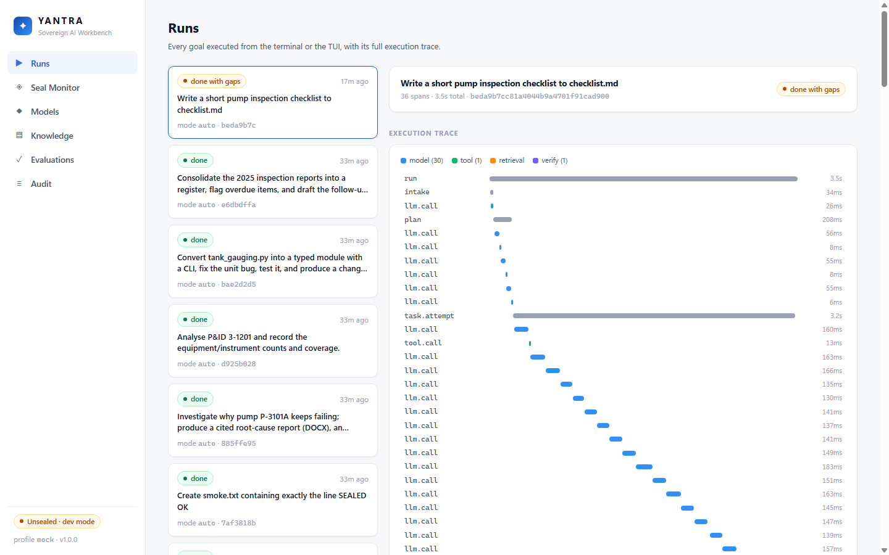
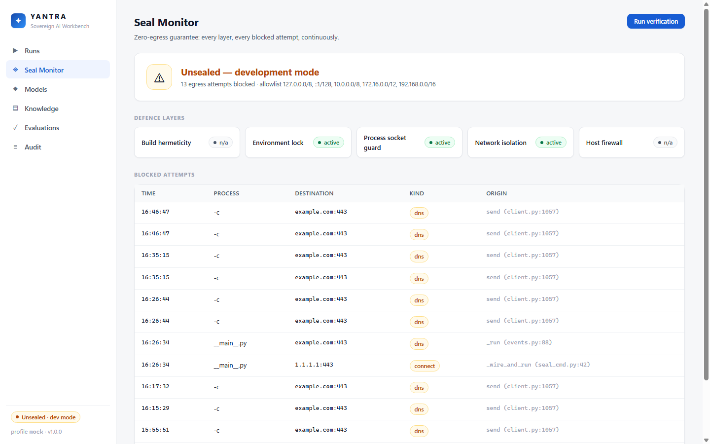

# YANTRA

**Sovereign on-premise agentic AI workbench.** YANTRA plans, executes, verifies and documents
large engineering tasks over an organisation's confidential files — documents, drawings,
spreadsheets, code — entirely on the organisation's own hardware, with every model call, tool
call and retrieval logged, and **no byte leaving the network**.

Built for SIH 2026 problem statement **SIH26117** (MRPL): a terminal coding-agent-class
workbench powered exclusively by open-weight models under 120B parameters, sealed on plant GPUs.

## What it does

- **Terminal-first agent** (`yantra`): decomposes a goal into a verified task DAG, executes one
  typed tool call at a time in a no-network sandbox, verifies every task programmatically and
  with a reviewer persona, and renders deliverables (DOCX/XLSX/PPTX/PDF/PNG) from templates —
  the model never formats anything.
- **Knowledge plane**: hybrid lexical (Tantivy) + dense + visual (Qdrant) retrieval with
  reranking and page-level citations, designed for 10⁷ documents.
- **P&ID understanding**: a deterministic drawing pipeline (OCR, ISA-5.1 tag grammar, symbol
  detection, line tracing) produces a graph the model reasons over; a rule engine finds design
  deviations.
- **The Seal**: five independent layers guarantee zero egress, continuously monitored and
  provable with `yantra seal verify` (Ed25519-signed certificate).
- **Everything observable**: every span in a local trace store, hash-chained audit log, web
  dashboard at `http://127.0.0.1:7331/` (runs, seal monitor, models, knowledge, evaluations, audit).

A three-minute tour for judges is scripted in [docs/PITCH.md](docs/PITCH.md); run it end to
end with `bash scripts/demo.sh`. What it proves today, with numbers, is in
[docs/EVALS.md](docs/EVALS.md):

```text
▶ tasks      (scenarios: pump reliability, P&ID review, code modernisation, consolidation)
  PASS  s2_pump_reliability   root_cause_report.docx + equipment_register.xlsx + work_order + MTBF chart
  PASS  s3_pid_review         P&ID graph extracted, coverage recorded
  PASS  s4_code_modernisation unit bug fixed, typed + CLI, proved in the sandbox
  PASS  s5_consolidation      delegate fan-out -> XLSX register + follow-up email drafts
▶ pid        planted design deviations found 3/3
▶ retrieval  recall@10 = 1.00 (lexical) on the generated truth set
```

| Runs — live execution traces | Seal Monitor — egress attempts blocked, live |
|---|---|
|  |  |

## Quickstart (dev, any OS)

```bash
uv sync --all-extras          # Python 3.12 env (uv installs the interpreter if missing)
pnpm install && pnpm run gen:types && pnpm --filter yantra-tui build
uv run yantra doctor          # environment report + profile recommendation
uv run yantra serve           # server on 127.0.0.1:7331 (mock engine when no GPU)
# in a second terminal:
node tui/dist/index.js        # the terminal UI
```

On POSIX hosts `make dev` does all of the above. No GPU? The `mock` profile runs the whole
pipeline (harness, tools, retrieval, vision, rendering) on a deterministic engine:
`YANTRA_PROFILE=mock YANTRA_SEALED=0 uv run yantra eval run tasks`.

## Deploy (docker-compose)

```bash
python scripts/fetch_models.py --profile standard   # connected machine, once
docker compose --profile standard up -d             # engines + qdrant + server, internal network
```

Profiles: `lite` (one 24 GB GPU, llama.cpp CPU sidecars), `standard` (one 80 GB / two 48 GB),
`refinery` (multi-GPU + Postgres + 120B heavy tier). Only `127.0.0.1:7331` is published;
everything else lives on an `internal: true` network.

## Air-gapped install

```bash
bash scripts/bundle.sh standard     # connected machine -> one checksummed tar (~90 GB standard)
# move by disk, then on the plant host:
tar -xf yantra-<version>-standard.tar -C /opt/yantra-bundle
cd /opt/yantra-bundle && sudo bash install.sh --with-nftables
```

`install.sh` verifies every checksum, loads images, places models, brings the stack up and
**fails hard unless `yantra seal verify` passes**. Details: [docs/RUNBOOK.md](docs/RUNBOOK.md).

## Windows / macOS notes

- **Windows**: server + TUI + dashboard run natively (this repository builds and tests on
  Windows 11); GPU serving via Docker Desktop/WSL2 with the `lite` compose profile, TUI on
  the host connecting to `127.0.0.1:7331`. The dev sandbox backend is `local` (unsealed,
  dev only) — sealed operation requires the Linux bwrap/docker sandbox.
- **macOS (Apple Silicon)**: development via llama.cpp Metal for the tiny models
  (`lite` CPU sidecars run as native processes); production serving is Linux/NVIDIA.

## Documentation

| Doc | Contents |
|---|---|
| [docs/ARCHITECTURE.md](docs/ARCHITECTURE.md) | System shape: conductor, gateway, knowledge, vision, seal |
| [docs/RUNBOOK.md](docs/RUNBOOK.md) | Install, operate, back up, troubleshoot |
| [docs/EXTENDING.md](docs/EXTENDING.md) | Add models, agents, skills, rules, tools, schemas, suites |
| [docs/SEAL.md](docs/SEAL.md) | Zero-egress layers + threat model |
| [docs/EVALS.md](docs/EVALS.md) | Current measured results (generated) |
| [docs/PITCH.md](docs/PITCH.md) | 3-minute judge demo script with timings |
| [docs/adr/](docs/adr/) | Every non-obvious decision, one page each |
| [docs/BUILD_LEDGER.md](docs/BUILD_LEDGER.md) | Exactly what works, what is deferred to hardware, and how to finish it |

## Repository map

| Path | Contents |
|---|---|
| `server/` | Python server: conductor (harness), model gateway, knowledge plane, vision, renderer, seal, observability, CLI |
| `tui/` | TypeScript/Ink terminal UI |
| `web/` | React dashboard (static, served by the server) |
| `agents/`, `models/`, `knowledge/`, `templates/`, `skills/` | Operator-editable data: agent personas, model registry & routing, P&ID knowledge packs, deliverable templates, procedural skills |
| `corpus/` | Synthetic refinery corpus generator (demo data + ground truth) |
| `scripts/` | demo, bundle, install, fetch_models, nftables, CI seal check |
| `docs/` | Architecture, ADRs, runbook, seal & threat model, pitch script, build ledger |

License: Apache-2.0. See `NOTICE.md` for bundled components.
