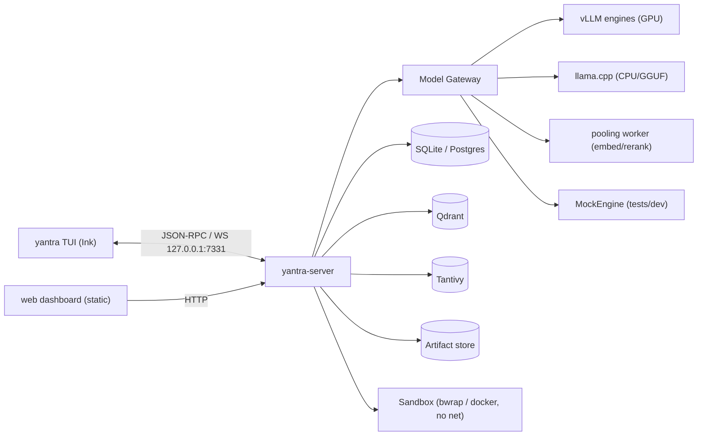

# YANTRA architecture

Kept current with the code. This file records
what is actually built and how the pieces fit.

## Process model

One Python server process (FastAPI + asyncio) owns everything: the Conductor (harness), tool
runtime, knowledge plane, vision, rendering, memory, guardrails, observability, and the model
gateway. Engines are loopback HTTP processes spawned by the gateway supervisor — or, under
docker-compose, sibling containers the supervisor *attaches* to by URL (ADR 0011). The TUI is
a Node/Ink process speaking JSON-RPC 2.0 over WebSocket. The dashboard is a static React
build served from inside the server package.

## Server package layout (`server/yantra_server/`)

| Package | Responsibility |
|---|---|
| `config.py` | Layered config (profile defaults → yantra.yaml → env → CLI) with per-value source tracking |
| `db/` | SQLAlchemy 2 models for every table in SPEC §19.3, Alembic migrations (SQLite WAL / Postgres) |
| `protocol/` | Pydantic RPC protocol (SPEC §19.2), exported to TS (`pnpm run gen:types`) → docs/PROTOCOL.md |
| `observe/` | OTel-API tracer → DB span exporter, hash-chained audit log |
| `gateway/` | Engines (vLLM/llama.cpp/pooling/mock), supervisor (spawn or attach), router + escalation, structured decoding, response/embedding caches, registry (<120B gate), bench |
| `conductor/` | The harness: intake → GoalSpec, planner + critic, DAG scheduler, executor loop (stable-prefix context, one tool per step, loop guard, ledger), verifier (typed checks + reviewer), escalation ladder, delegate, crash-resume |
| `tools/` | Tool contract + registry (typed schemas, few-shots), permission engine + async broker, sandboxes (bwrap/docker/local-dev), MCP stdio client, idempotent runtime |
| `knowledge/` | Ingestion (parse→chunk→enrich→embed), Tantivy lexical (tag-preserving), Qdrant dense/visual, weighted-RRF fusion + rerank, citations, retrieval eval |
| `vision/` | P&ID pipeline: ISA-5.1 tag grammar, detector (RF-DETR hook + CV heuristic + truth sidecar), graph builder, YAML rule engine, overlay annotator |
| `render/` | 13 deliverable schemas; DOCX/XLSX/PPTX/PDF/MD renderers + charts/diagrams; provenance sidecars — the model never formats |
| `memory/` | Session/project (YANTRA.md), episodic, semantic (provenance-required facts), procedural (SKILL.md + approval queue) |
| `guard/` | Injection defence (delimiter+spotlight+classifier), PII redaction, domain safety (hard verifier gate), output checks |
| `seal/` | Env lock, process socket guard (Py+Node), verification + Ed25519 certificate, egress demo |
| `evals/` | Suite runner (tasks/retrieval/pid/seal_smoke/resilience/latency), scripted demo scenarios, results → eval tables + dashboard |
| `cli/` | `yantra` Typer CLI: serve, run/resume, models, bench, index, seal, eval, corpus, agents, audit, doctor |
| `app.py` | FastAPI app: `/api/*`, `/rpc` WebSocket, static dashboard |

## Data flow (one goal)

Goal → intake (GoalSpec) → planner+critic (task DAG) → scheduler → per task: executor loop
(THINK constrained to oneOf(action∪finish) → ACT via tool runtime in the sandbox → OBSERVE
compacted) → verifier (typed checks + reviewer + domain safety) → escalation ladder on
failure (retry → raise effort → best-of-n redraft → heavy model → replan → partial-with-gaps)
→ render deliverables → memory consolidation. Every arrow is a span carrying
`run_id`/`task_id`/`step_id`; side effects also append to the audit chain.

## Decisions

Architecture decision records live in `docs/adr/`: 0001 engine choice, 0002 no-framework
harness, 0003 Tantivy+Qdrant, 0004 bwrap sandbox, 0005 Windows build environment,
0006 sync-core DB, 0007 CLI binary, 0008 best-of-n redraft, 0009 fusion weights (by numbers),
0010 scripted-scenario evals + mock cache-off, 0011 compose topology.

## Conventions

- Python 3.12, `mypy --strict`, ruff; Pydantic v2 at every boundary; sync SQLAlchemy core
  offloaded to threads from async code (ADR 0006).
- All operator-extensible behaviour is data files (`agents/`, `models/`, `knowledge/`,
  `templates/`, `skills/`, `tools/mcp/`), validated by CLI commands.
- Every subsystem emits spans; anything side-effecting also appends to the audit chain.
